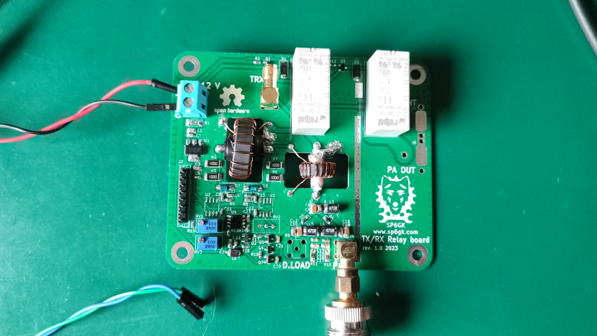

# TXRX_Relay_Board
A PCB for switching the signal path between RX and TX in a high-power HF amplifier, such as the Forte 600. It includes RX/TX relays, an input SWR bridge, and analog input over power protection.

For the theory of operation and functionality, please refer to section 2.2.1 of the Forte 600 documentation [link](https://github.com/SP6GK/Forte-600-HF-RF-Amplifier/blob/main/Optimization_HF_amplifier_TLT_Forte600Documentation.pdf).

## Change log:
### 05.09.2024 - rev 1.2:
- Removed unconnected tracks and fixed some footprint libraries, as well as the relative path to the custom schematic template (thanks to vk4kyt for pointing this out).
- Changed NPN and PNP transistors to more common types.
- Added coupler measurements and simulated the overpower protection circuit in Falstad.
